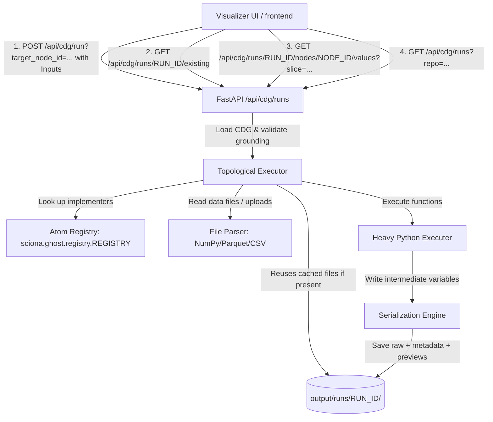

# Implementation Plan: Local CDG Execution & Intermediate Value Visualization

This plan outlines the changes required to enable local execution of Capability Dependency Graphs (CDGs) directly inside the localhost-bound visualizer dashboard. It adds support for supplying custom inputs (constants, JSON, and files) and inspecting the intermediate inputs/outputs at each execution node.

---

## 1. Goal

Enable users of the CDG Visualizer (running on `localhost:8080` via `sciona visualize --api`) to:
1. Configure execution inputs (constant fields, JSON blobs, or NumPy/Parquet/CSV file paths or direct file uploads) for the root inputs of a loaded CDG.
2. Verify that the CDG is fully grounded. If not, throw an explicit, user-friendly error.
3. Trigger execution of either the entire CDG or a specific target node:
   - **Incremental Node Execution:** Triggering a run on a specific node will automatically identify all its topologically sorted ancestors. The executor will run them in order, skipping any ancestor that already has valid computed outputs in the active `run_id` directory.
4. Save and index all intermediate variables (shapes, dtypes, values, and plots/images) produced at each atomic node.
5. Provide first-class slicing support for large multidimensional arrays (e.g. `[0:100, :, 0]`) to inspect sections of the data without crashing the browser or overloading networks.
6. Display visual indicators on the Cytoscape graph:
   - Render a **"View" icon** or status badge directly on the Cytoscape graph nodes that have already saved outputs in the active run. Clicking this icon slides out the detail panel and opens the Execution tab.
7. Manage execution sessions (`run_id` tracking):
   - Display the active `run_id` prominently in the header bar.
   - Sync the `run_id` into the URL query parameters (e.g., `?repo=...&run_id=abcdef123`).
   - Reload previous run files if the `run_id` is present in the URL query parameters when the page loads, automatically decorating completed nodes with "View" icons.
   - Provide a **"New Inputs"** button. Clicking this button clears the active execution state, resets the input forms, and generates a new `run_id` for a fresh session.
8. **Run History Menu:**
   - Display a **"History"** button/icon in the toolbar. Clicking it opens a slide-out panel listing all recent runs associated with the currently loaded CDG.
   - Users can click any historical run to reload it, restoring all intermediate states on the canvas.

---

## 2. Architecture & Design



### Supported Data Types
Based on `sciona-kb` atom specifications, we support:
- **Primitives:** `int`, `float`, `bool`, `str` (rendered as direct input fields).
- **Collections:** `list[str]`, `list[float]`, `dict[str, Any]`, and nested tuples (rendered as JSON inputs).
- **Arrays/Matrices:** `NDArray[np.float64]`, `NDArray[np.int64]`, `np.ndarray`, etc. (rendered as file paths on disk or file uploads).

### Run History Scans
- When a run is initialized, the backend saves a `run_metadata.json` under `output/runs/{run_id}/` containing `repo`, `timestamp`, and `status`.
- The `GET /api/cdg/runs?repo={repo}` endpoint scans all directories in `output/runs/` and reads their `run_metadata.json`. It returns a sorted list (newest first) of runs matching the specified `repo`.

---

## 3. Step-by-Step Task List

### Phase 1: Backend Implementation

#### Task 1.1: Expose `matched_primitive` in CDG loading
- **File:** [sciona/visualizer/cdg.py](file:///Users/conrad/personal/sciona-matcher/sciona/visualizer/cdg.py)
- **Change:** In `_load_cdg`, add `"matched_primitive": atom.get("matched_primitive", "")` to the returned dictionary for each node.

#### Task 1.2: Build the Incremental Executor, Caching & Slicing Engine
- **File:** Create `sciona/visualizer/runner.py`
- **Logic:**
  - Import atoms from configured sources to populate `REGISTRY`.
  - Validate CDG grounding: throw a clean `ValueError` listing ungrounded leaves.
  - Implement a safe parser for numpy-style slices (e.g. `[0:10, :]`).
  - Read inputs (`.npy`, `.parquet`, `.csv`, `.json`).
  - Implement ancestor-finding logic: trace upstream data-flow edges from a target node.
  - Implement caching: look up existing saved variables inside `output/runs/{run_id}/{node_id}/`. Load directly if present.
  - Execute leaf nodes in topological order and write outcomes to disk.
  - On run startup, write `output/runs/{run_id}/run_metadata.json` with execution parameters and CDG `repo` identifier.

#### Task 1.3: Expose API routes in FastAPI
- **File:** Create `sciona/visualizer/runner_api.py`
- **Logic:** Define endpoints for:
  - `POST /api/cdg/run`: executes the CDG. Accepts optional `target_node_id` query param.
  - `GET /api/cdg/runs`: accepts a `repo` query string and scans `output/runs/` directories for matching metadata, returning a sorted list of runs.
  - `GET /api/cdg/runs/{run_id}/existing`: returns list of node IDs that already have intermediate value directories on disk.
  - `GET /api/cdg/runs/{run_id}/nodes/{node_id}/values`: returns inputs/outputs, dtypes, shapes, and basic statistics.
  - `GET /api/cdg/runs/{run_id}/nodes/{node_id}/values/{value_name}/slice`: applies slice parameters and returns values.
  - `POST /api/cdg/upload`: handles file uploads.
- **File:** [sciona/visualizer/app.py](file:///Users/conrad/personal/sciona-matcher/sciona/visualizer/app.py)
- **Change:** Register the new router.

---

### Phase 2: Frontend Implementation

#### Task 2.1: HTML updates for the UI
- **File:** [sciona/static/index.html](file:///Users/conrad/personal/sciona-matcher/sciona/static/index.html)
- **Change:**
  - Add active `Run ID: <span id="active-run-id">—</span>` display in the header bar.
  - Add "Run CDG", "History", and "New Inputs" (hidden initially) buttons in the toolbar.
  - Add modal markup for the input settings.
  - Add a **History slide-out panel** (similar to the CDG Browser panel) to display the list of recent runs.
  - Load `Chart.js` via CDN: `<script src="https://cdn.jsdelivr.net/npm/chart.js"></script>`.
  - Add the "Execution" tab selector and the corresponding `<div id="tab-execution" class="tab-content">` inside the detail panel. Include a "Run Node" button in the node detail header when an atomic leaf node is selected.

#### Task 2.2: Modal & Slide-out Menu styling
- **File:** [sciona/static/style.css](file:///Users/conrad/personal/sciona-matcher/sciona/static/style.css)
- **Change:** Style inputs, JSON textareas, status classes (success/fail colors), canvas overlays for charting, and file upload lists. Style the "View" badge indicators for Cytoscape nodes. Add styling for the slide-out history panel.

#### Task 2.3: Execution input form and session manager
- **File:** Create `sciona/static/runner_panel.js`
- **Logic:**
  - Track session status. Generate a UUID `run_id` when the user opens input configuration or loads a fresh graph.
  - Sync the `run_id` to the URL using `window.history.pushState`.
  - Locate CDG entry ports and build dynamic input fields.
  - Manage file uploads via `/api/cdg/upload`.
  - Handle "New Inputs" button click: clear inputs, hide the "New Inputs" button, generate a fresh `run_id`, update URL, and clear graph execution highlights/icons.
  - Submit execution data to `/api/cdg/run`. Render explicit warnings for grounding errors.
  - Catch existing session files on page load by calling `/api/cdg/runs/{run_id}/existing` and add "View" icons.
  - Wire the "History" panel: fetch recent runs via `GET /api/cdg/runs?repo={repo}` on open. Display runs in a scrollable list (timestamp, run ID status). Click a run to set the active `run_id`, load existing nodes, and populate the canvas.

#### Task 2.4: Node-level Execution UI & Cytoscape Badges
- **File:** [sciona/static/graph_core.js](file:///Users/conrad/personal/sciona-matcher/sciona/static/graph_core.js) or [sciona/static/graph_styles.js](file:///Users/conrad/personal/sciona-matcher/sciona/static/graph_styles.js)
- **Change:**
  - Add styling rules in Cytoscape to render a visual badge (e.g. a small document/eye icon or overlay badge) on nodes that have execution outputs.
  - Wire node-click handlers: if the user clicks the "View" icon, slide out the detail panel and activate the "Execution" tab.
  - Wire the "Run Node" action button next to the node name in the detail panel to trigger node-level execution.

#### Task 2.5: Detail panel viewer for intermediate values
- **File:** [sciona/static/detail_panel.js](file:///Users/conrad/personal/sciona-matcher/sciona/static/detail_panel.js)
- **Change:**
  - Expand `populateDetailPanel` to query and populate the new "Execution" tab content.
  - Add a "Slice Indexing" input text box for large arrays.
  - Fetch intermediate value metadata and query slices on value changes.
  - Display summary tables, line charts via Chart.js, or image previews.

#### Task 2.6: Application wiring
- **File:** [sciona/static/app.js](file:///Users/conrad/personal/sciona-matcher/sciona/static/app.js)
- **Change:** Include `runner_panel.js` in execution pipelines, bind click handlers, and clear execution highlights when reloading/browsing new CDGs.

---

## 4. How to Run & Validate

1. Run Memgraph and start the visualizer:
   ```bash
   docker compose up -d memgraph
   sciona visualize --api
   ```
2. Navigate to `http://localhost:8080`.
3. Load a sample CDG.
4. Click **Run CDG**, configure inputs (providing a path to a numpy signal or uploading it), and execute.
5. Alternatively, select a specific node in the graph and click **Run Node** to perform incremental dependency execution.
6. Inspect intermediate values, use slicing commands like `[0:100, 0]` to subset large matrices, and inspect the resulting visual charts and tables.
7. Verify that reloading the URL with `?run_id=UUID` restores the execution badge status of completed nodes.
8. Click **History** in the toolbar to browse and reload previous run sessions.
9. Click **New Inputs** to reset the graph state, generate a new `run_id`, and prepare for a clean run.
