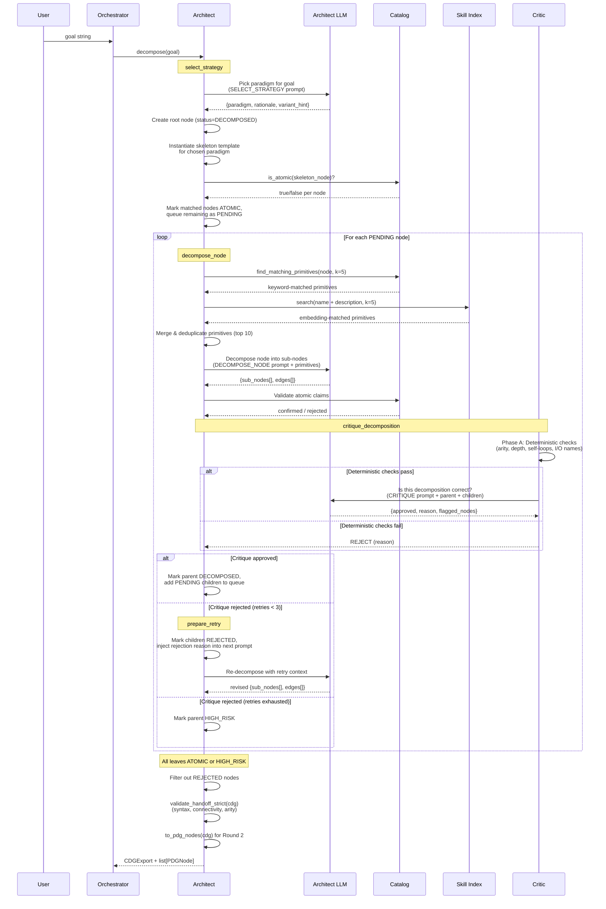

# Round 1: Architect -- Decomposition

Decomposes a high-level goal into a Conceptual Dependency Graph (CDG) of atomic
algorithmic operations.

## Data produced

| Artifact | Type | Description |
|----------|------|-------------|
| CDG | `CDGExport` | Tree of `AlgorithmicNode` + `DependencyEdge` with all leaves ATOMIC |
| PDG Nodes | `list[PDGNode]` | One per atomic leaf, carrying formal statement + informal description |
| Metadata | `dict` | goal, paradigm, thread_id, num_nodes, num_edges |

## LLM calls per node

| Step | Prompt | Output |
|------|--------|--------|
| select_strategy | SELECT_STRATEGY_SYSTEM/USER | `{paradigm, rationale}` |
| decompose_node | DECOMPOSE_NODE_SYSTEM/USER | `{sub_nodes[], edges[]}` |
| critique | CRITIQUE_SYSTEM/USER | `{approved, reason, flagged_nodes[]}` |
