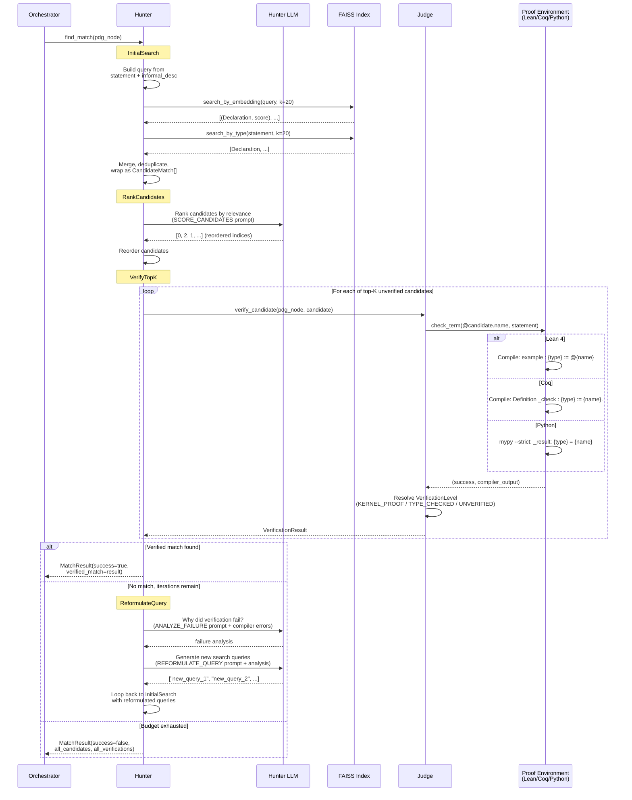

# Round 2: Hunter -- Predicate Grounding

Grounds each atomic predicate from the CDG to a verified library function by
searching a FAISS index and type-checking candidates against the target prover.

## Data produced

| Artifact | Type | Description |
|----------|------|-------------|
| Match Result | `MatchResult` | Verified match (if found) + full audit trail of candidates and verifications |
| Verification Level | `VerificationLevel` | KERNEL_PROOF (Lean/Coq), TYPE_CHECKED (Python), or UNVERIFIED |
| Compiler Feedback | `list[str]` | Error messages from failed verifications, used for query reformulation |

## Hunter state accumulated per PDGNode

| Field | Description |
|-------|-------------|
| `candidates_found` | All discovered candidates across iterations |
| `verification_results` | All verification attempts (pass and fail) |
| `queries_tried` | Query history for deduplication |
| `compiler_feedback` | Error messages for reformulation context |
| `iteration` | Current iteration counter (vs. max_iterations) |

## LLM calls per iteration

| Step | Prompt | Output |
|------|--------|--------|
| RankCandidates | SCORE_CANDIDATES | `[indices]` (reordered) |
| ReformulateQuery | ANALYZE_FAILURE | failure analysis text |
| ReformulateQuery | REFORMULATE_QUERY | `["query", ...]` |
