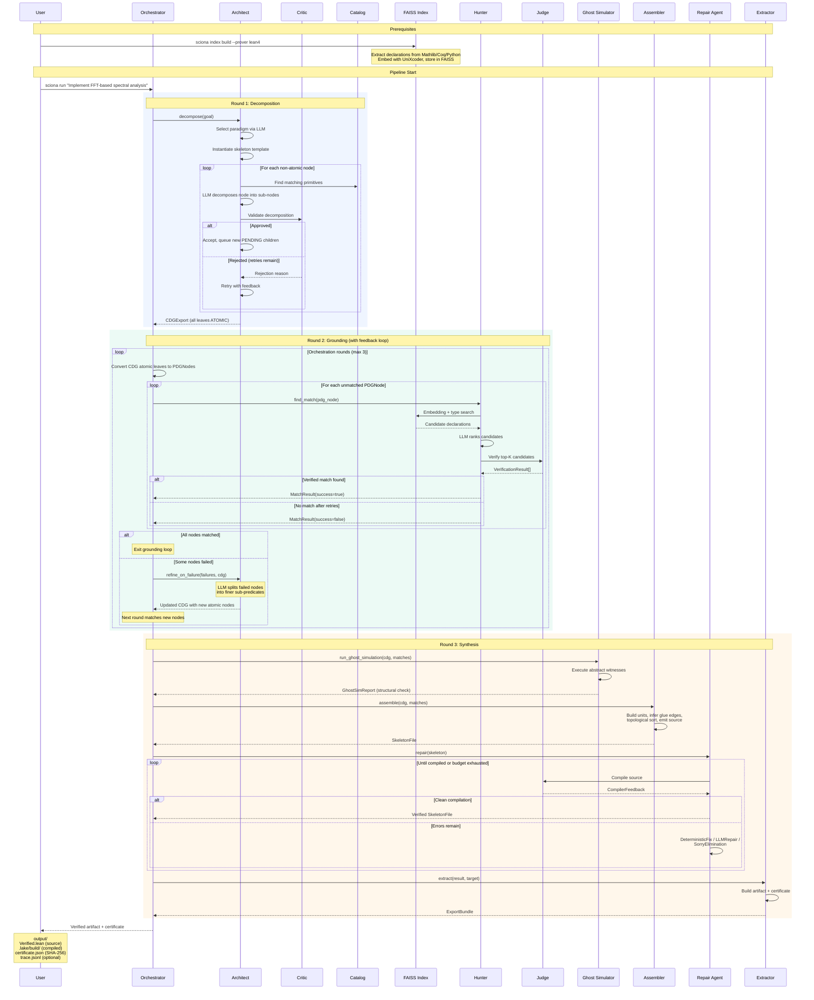

# End-to-End: Creating an Algorithm from Scratch

High-level view of the full pipeline from a user's goal to a verified,
exportable artifact.



## With Principal (optimised pipeline)

When invoked via `sciona optimize`, the Principal wraps the above pipeline in a
meta-optimisation loop. See [05-principal.md](05-principal.md) for the detailed
sequence diagram.

```
Goal + Benchmark dataset
  |
  |  Principal: seed (Optuna suggests parameters)
  v
Architect decomposes goal (new thread)
  |
  |  Principal: forward (ghost sim + synthesis)
  v
ExportBundle (instrumented)
  |
  |  Principal: evaluate (subprocess benchmark)
  v
BenchmarkResult (global_loss + per-node telemetry)
  |
  |  Principal: backward (credit assignment)
  v
NodeGradient[] (bottleneck identified)
  |
  |  Principal: time-travel update (fork Architect checkpoint)
  v
New CDG with constraint injected
  |
  |  (loop back to forward)
  v
Best trial's artifact after budget exhausted
```

## Pipeline phases summary

```
Goal (string)
  |
  |  Round 1: DECOMPOSITION
  |  Architect + Critic + Catalog + Skill Index
  v
CDGExport (tree of atomic nodes + edges)
  |
  |  Round 2: GROUNDING (with feedback)
  |  Hunter + Index + Judge + Orchestrator refinement
  v
CDGExport (refined) + list[MatchResult]
  |
  |  Round 3: SYNTHESIS
  |  Ghost Sim + Assembler + Repair Agent + Extractor
  v
ExportBundle (verified source + compiled artifact + certificate)
  |
  |  (Optional) PRINCIPAL META-OPTIMISATION
  |  Evaluator + CreditAssigner + Optuna + Time-Travel
  v
Best ExportBundle across all trials
```

## Role participation by phase

| Role | Round 1 | Round 2 | Round 3 | Principal |
|------|---------|---------|---------|-----------|
| **Orchestrator** | Invokes Architect | Drives match loop + refinement | Drives assembly + repair + export | -- |
| **Architect** | Decomposes goal | Refines on failure | -- | Time-travel fork + re-decompose |
| **Critic** | Validates decompositions | -- | -- | -- |
| **Catalog** | Atomicity oracle | -- | -- | -- |
| **Skill Index** | Semantic primitive search | -- | -- | -- |
| **Hunter** | -- | Searches + ranks candidates | -- | -- |
| **Index** | -- | Candidate retrieval | -- | -- |
| **Judge** | -- | Type-checks candidates | Compiles skeleton each repair iteration | -- |
| **Ghost Simulator** | -- | -- | Pre-assembly structural validation | Early pruning + precision gradients |
| **Assembler** | -- | -- | CDG + matches -> SkeletonFile | Telemetry instrumentation |
| **Repair Agent** | -- | -- | Iterative compilation + patching | -- |
| **Extractor** | -- | -- | Artifact build + certificate | -- |
| **Principal** | -- | -- | -- | Outer optimisation loop |

## Feedback loops

| Loop | Trigger | Mechanism | Max iterations |
|------|---------|-----------|----------------|
| **Architect retry** | Critic rejects decomposition | Re-decompose with rejection reason | 3 per node |
| **Orchestrator refinement** | Hunter fails to match a node | LLM splits node into sub-predicates | 3 rounds |
| **Hunter reformulation** | Verification fails | LLM analyzes errors, generates new queries | 5 per node |
| **Repair iteration** | Compilation fails | DeterministicFix / LLMRepair / SorryElimination | 10 iterations |
| **Principal trial** | Bottleneck identified | Time-travel fork + constraint injection | configurable (default 50) |
