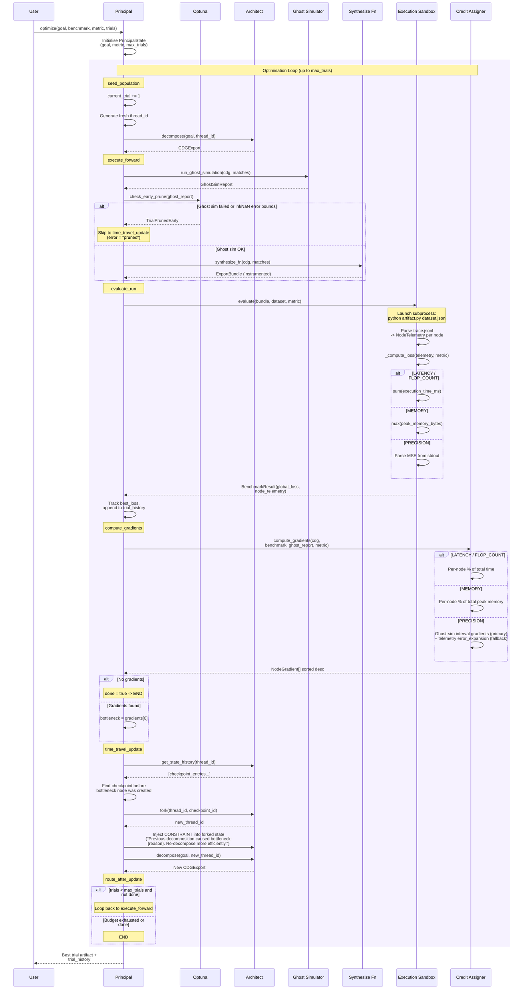

# Principal: Meta-Optimisation Loop

Wraps the four-round pipeline in a NAS-style optimisation loop that uses
the Architect's checkpoint time-travel for coordinate descent over decomposition
structure.

## State

| Field | Type | Description |
|-------|------|-------------|
| `goal` | `str` | High-level goal string |
| `metric` | `OptimizationMetric` | LATENCY, MEMORY, PRECISION, or FLOP_COUNT |
| `dataset_path` | `str` | Path to benchmark dataset |
| `max_trials` | `int` | Trial budget (default 50) |
| `current_trial` | `int` | Current trial counter |
| `best_loss` | `float` | Best global loss seen so far |
| `thread_id` | `str` | Current Architect thread ID |
| `cdg` | `CDGExport` | Current decomposition graph |
| `export_bundle` | `ExportBundle` | Current synthesised artifact |
| `ghost_report` | `GhostSimReport` | Ghost simulation result |
| `benchmark` | `BenchmarkResult` | Per-node telemetry + global loss |
| `top_gradient` | `NodeGradient` | Top bottleneck gradient |
| `bottleneck_node_id` | `str` | Node ID of the bottleneck |
| `bottleneck_reason` | `str` | Human-readable explanation |
| `trial_history` | `list[dict]` | Trial number, loss, thread_id per trial |

## Routing logic

| Router | Condition | Destination |
|--------|-----------|-------------|
| `route_after_forward` | `done = true` | END |
| | `error` (pruned early) | time_travel |
| | otherwise | evaluate |
| `route_after_gradients` | `done = true` | END |
| | `current_trial >= max_trials` | END |
| | non-pruned error | END |
| | otherwise | time_travel |
| `route_after_update` | `done = true` | END |
| | `current_trial >= max_trials` | END |
| | otherwise | forward |

## Early pruning criteria

| Condition | Source | Result |
|-----------|--------|--------|
| Ghost simulation ran and failed | `GhostSimReport.passed = false` | `TrialPrunedEarly` |
| Infinite precision gradient | `precision_gradients[nid] = inf` | `TrialPrunedEarly` |
| NaN precision gradient | `precision_gradients[nid] = NaN` | `TrialPrunedEarly` |

## Credit assignment by metric

| Metric | Signal | Formula |
|--------|--------|---------|
| LATENCY | `execution_time_ms` | `node_ms / total_ms * 100%` |
| FLOP_COUNT | `execution_time_ms` (proxy) | `node_ms / total_ms * 100%` |
| MEMORY | `peak_memory_bytes` | `node_bytes / total_bytes * 100%` |
| PRECISION | Ghost-sim interval widths (primary) or telemetry `error_expansion` (fallback) | `abs(node_grad) / total_grad * 100%` |
