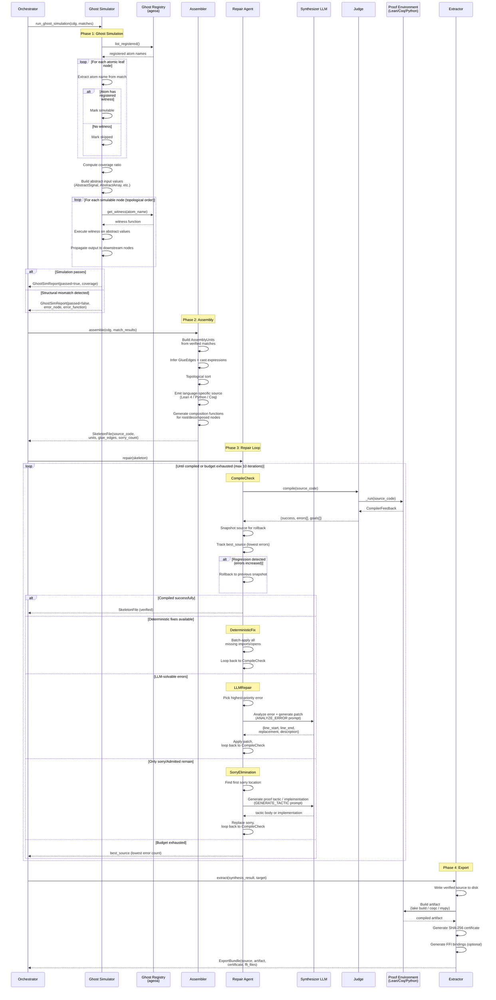

# Round 3: Synthesizer -- Assembly, Simulation, Repair, Export

Composes matched atoms into a single compilable source file, validates it
through ghost simulation, repairs compilation errors, and exports the verified
artifact.

## Phases and data flow

| Phase | Input | Output | LLM? | Compiler? |
|-------|-------|--------|------|-----------|
| Ghost Simulation | CDG + MatchResults | GhostSimReport | No | No |
| Assembly | CDG + MatchResults | SkeletonFile | No | No |
| Repair Loop | SkeletonFile | SkeletonFile (repaired) | Yes | Yes (each iteration) |
| Export | SynthesisResult | ExportBundle + Certificate | No | Yes (final build) |

## Repair Agent error priority

| Priority | Category | Fix strategy |
|----------|----------|--------------|
| 0 | TYPE_MISMATCH | LLMRepair |
| 1 | UNIVERSE_MISMATCH | LLMRepair |
| 2 | MISSING_IMPORT | DeterministicFix (batch) |
| 3 | SYNTAX | LLMRepair |
| 4 | UNKNOWN | LLMRepair |
| 5 | UNSOLVED_GOAL | SorryElimination |

## LLM calls per repair iteration

| Node | Prompt | Output |
|------|--------|--------|
| LLMRepair | ANALYZE_ERROR_SYSTEM/USER | `{line_start, line_end, replacement}` |
| SorryElimination | GENERATE_TACTIC_SYSTEM/USER | tactic body or implementation code |
